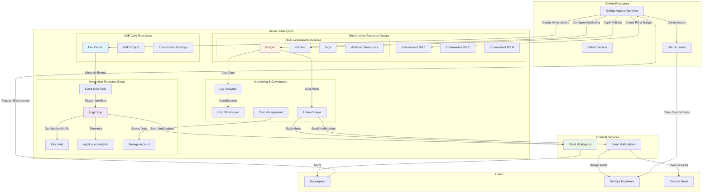
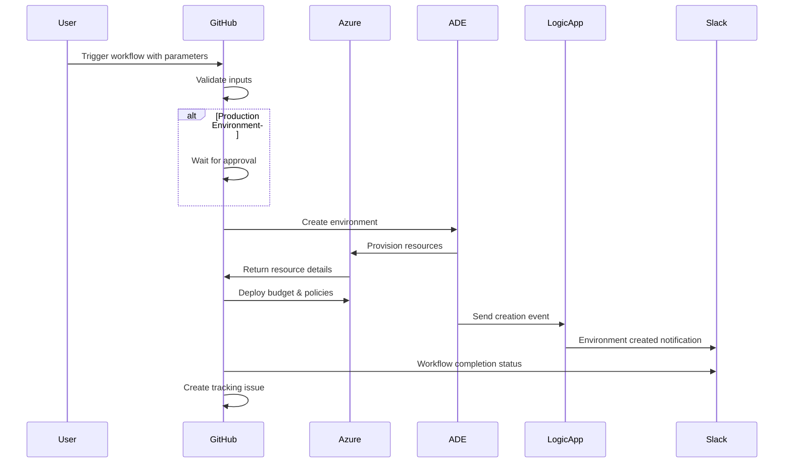
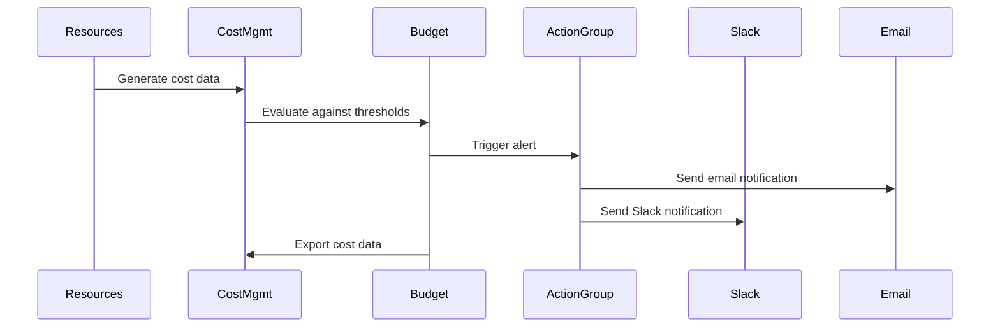

# Azure Deployment Environments - Enterprise Extensions Architecture

## 🏗️ Solution Architecture

## 🎯 Component Details

### 1. GitHub Actions Workflow
**Purpose**: Centralized environment provisioning and management

**Key Features**:
- 🎮 **Workflow Dispatch**: Manual trigger with parameters
- ✅ **Input Validation**: Date validation, JSON parameter validation
- 🔐 **Approval Gates**: Production environment approval
- 📊 **Cost Tracking**: Per-user budget allocation
- 🏷️ **Governance**: Automatic policy application
- 📱 **Notifications**: Slack integration for status updates
- 📋 **Issue Tracking**: Automatic GitHub issue creation

**Workflow Steps**:
1. Validate inputs (expiration date, JSON parameters)
2. Production approval (if required)
3. Provision ADE environment
4. Wait for deployment completion
5. Setup budget and governance
6. Apply Azure policies
7. Send Slack notifications
8. Create tracking GitHub issue

### 2. Slack Integration (Logic App)
**Purpose**: Real-time event-driven notifications for ADE lifecycle events

**Architecture Components**:
- 🔄 **Event Grid System Topic**: Captures ADE events
- 🚀 **Logic App Standard**: Processes events and sends notifications
- 🔐 **Key Vault**: Secure storage for Slack webhook URL
- 📊 **Application Insights**: Telemetry and monitoring
- 🗂️ **Storage Account**: Dead letter queue for failed events

**Supported Events**:
- ✅ **Environment Created**: Rich notification with portal links
- ⚠️ **Environment Expiring**: Actionable warning with extension links
- 🗑️ **Environment Deleted**: Confirmation notification
- ❌ **Deployment Failed**: Error details with troubleshooting links

**Security Features**:
- 🔐 Managed Identity authentication
- 🔑 Key Vault integration for secrets
- 🛡️ Secure webhook validation
- 📝 Comprehensive audit logging

### 3. Budget Governance System
**Purpose**: Per-user cost management and budget enforcement

**Budget Model**:
- 💰 **$200 USD per user** across all environments
- 📅 **Monthly allocation** with annual reset
- 🏷️ **Tag-based filtering** for accurate cost attribution
- ⚡ **Real-time monitoring** with predictive alerts

**Alert Thresholds**:
| Threshold | Type | Action | Recipients |
|-----------|------|--------|------------|
| 50% | Actual | 📧 Email Warning | User + DevOps |
| 80% | Actual | ⚠️ High Usage Alert | User + DevOps |
| 90% | Forecast | 🔮 Projected Overage | User + DevOps |
| 100% | Actual | 🚨 Budget Exceeded | User + DevOps + Finance |

**Governance Components**:
- 📊 **Azure Budgets**: Automated budget creation per environment
- 📧 **Action Groups**: Multi-channel alert delivery
- 💾 **Cost Export**: Daily cost data export for analysis
- 📈 **Workbooks**: Cost visualization dashboards
- 🔍 **Anomaly Detection**: Unusual spending pattern alerts

### 4. Policy Enforcement
**Purpose**: Automated governance and compliance

**Policy Types**:
- 🏷️ **Tagging Policies**: Automatic tag application
  - `environment-name`: ADE environment identifier
  - `user-email`: Cost attribution and ownership
  - `expiration-date`: Lifecycle management
  - `environment-type`: Classification (dev/test/prod)
  - `cost-center`: Financial allocation
  - `created-by-ade`: ADE resource identification

- 🖥️ **Resource Restrictions**: Cost control measures
  - VM size limitations (B-series, D2s/D4s only)
  - Storage SKU restrictions (Standard tiers)
  - SQL Database tier limits (Basic, S0-S2, GP_S)

- 📋 **Resource Type Allowlist**: Security and compliance
  - Web Apps and App Service Plans
  - SQL Servers and Databases
  - Storage Accounts
  - Key Vaults
  - Virtual Networks and NSGs
  - Container services
  - Cognitive Services

## 🔄 Event Flow Architecture

### Environment Creation Flow

### Budget Alert Flow

## 🔐 Security Architecture

### Authentication & Authorization
- 🔑 **Managed Identities**: Azure resource authentication
- 👤 **Service Principal**: GitHub Actions authentication
- 🔐 **Key Vault**: Secure secret storage
- 🛡️ **RBAC**: Least privilege access control

### Data Protection
- 🔒 **TLS 1.2+**: All communications encrypted
- 🗝️ **Key Vault Encryption**: Secrets encrypted at rest
- 🔄 **Token Rotation**: Automatic credential refresh
- 📝 **Audit Logging**: Comprehensive activity tracking

### Network Security
- 🌐 **Service Endpoints**: Secure Azure service communication
- 🚫 **Public Access**: Disabled where possible
- 🔥 **Firewall Rules**: Restrictive access policies
- 🛡️ **Private Endpoints**: For sensitive services

## 📊 Monitoring & Observability

### Application Monitoring
- 📈 **Application Insights**: Logic App telemetry
- 📊 **Workbooks**: Cost and usage dashboards
- 🔍 **Log Analytics**: Centralized logging
- ⚡ **Real-time Alerts**: Proactive issue detection

### Cost Monitoring
- 💰 **Budget Tracking**: Real-time cost monitoring
- 📈 **Trend Analysis**: Historical cost patterns
- 🔮 **Forecast Alerts**: Predictive overage warnings
- 📊 **Cost Breakdown**: Resource-level attribution

### Performance Metrics
- ⏱️ **Workflow Duration**: Deployment timing
- 📨 **Notification Delivery**: Alert reliability
- 🎯 **Success Rates**: Deployment success metrics
- 🔄 **Retry Patterns**: Error handling effectiveness

## 🚀 Scalability Considerations

### Horizontal Scaling
- 🔄 **Logic App Scaling**: Automatic throughput adjustment
- 📈 **Budget Scaling**: Per-user budget multiplication
- 🏗️ **Resource Group Isolation**: Independent environment scaling
- 📊 **Monitoring Scaling**: Distributed telemetry collection

### Performance Optimization
- ⚡ **Parallel Processing**: Concurrent workflow execution
- 💾 **Caching Strategies**: Efficient data retrieval
- 🔄 **Async Operations**: Non-blocking workflow steps
- 📈 **Batch Operations**: Bulk resource provisioning

## 🎯 Benefits Summary

### For Developers
- 🎮 **Self-Service**: On-demand environment provisioning
- ⏱️ **Fast Deployment**: Automated infrastructure setup
- 📱 **Real-time Updates**: Slack notifications for all events
- 🎯 **Catalog Choice**: Multiple environment templates

### For DevOps Teams
- 🎛️ **Centralized Control**: GitHub Actions workflow management
- 📊 **Cost Visibility**: Per-user budget tracking
- 🛡️ **Governance**: Automated policy enforcement
- 📈 **Monitoring**: Comprehensive observability

### For Finance Teams
- 💰 **Cost Control**: Per-user budget limits
- 📧 **Proactive Alerts**: Budget threshold notifications
- 📊 **Reporting**: Detailed cost breakdown and exports
- 🔮 **Forecasting**: Predictive overage warnings

### For Organizations
- 🏢 **Enterprise Ready**: Scalable, secure, maintainable
- 🔄 **Minimal Maintenance**: Event-driven, automated operations
- 📋 **Compliance**: Built-in governance and audit trails
- 🎯 **Strategic Value**: Focus on business outcomes vs. infrastructure

---

**Enterprise-Grade Solution for Azure Deployment Environments**
*Designed for scalability, security, and operational excellence*