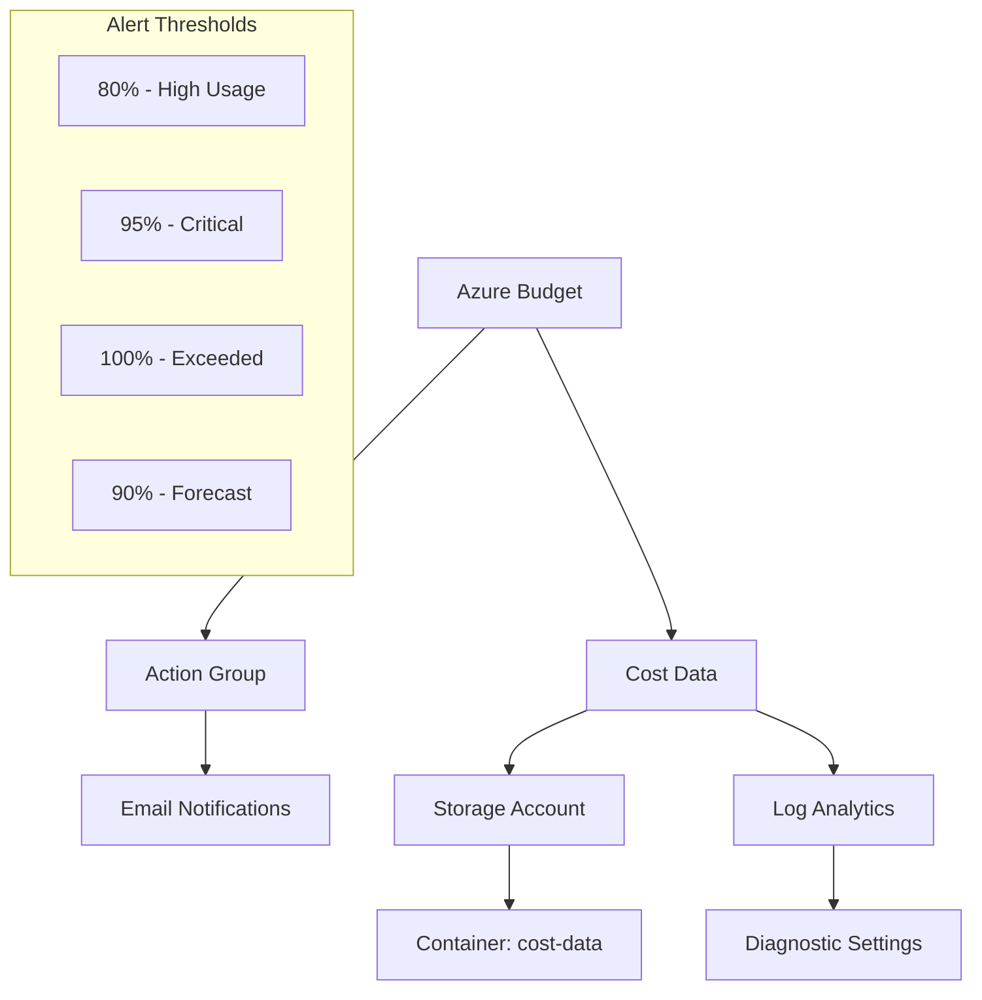

# Azure Deployment Environments - Budget Governance Module

[](https://www.terraform.io/)
[](https://registry.terraform.io/providers/hashicorp/azurerm/latest)
[](LICENSE)

This Terraform module implements enterprise-grade budget governance for Azure Deployment Environments (ADE). It provides automated cost monitoring, multi-threshold alerting, and comprehensive cost tracking capabilities to ensure responsible cloud resource usage.

## 🎯 Features

- **Per-User Budget Governance**: $200 default budget allocation per user with customizable amounts
- **Multi-Threshold Alerting**: 80%, 95%, 100% actual usage + 90% forecasted usage alerts
- **Enterprise Tagging**: Comprehensive tagging strategy for cost allocation and governance
- **Secure Storage**: Cost monitoring data storage with enterprise security configurations
- **Log Analytics Integration**: Centralized logging for cost tracking and analysis
- **Deletion Protection**: Configurable resource protection for production environments

## 📋 Requirements

| Name | Version |
|------|---------|
| terraform | >= 1.6 |
| azurerm | >= 3.80 |
| random | >= 3.4 |

## 🚀 Quick Start

### 1. Basic Usage

```hcl
module "ade_budget_governance" {
  source = "./infrastructure/terraform"

  # Required variables
  resource_group_name = "rg-ade-dev-001"
  location           = "East US 2"
  user_email         = "john.doe@company.com"
  user_hash          = "jdoe001"
  environment_name   = "dev-env-001"
  budget_amount      = 200.00
  budget_start_date  = "2024-01-01"
  budget_end_date    = "2024-12-31"
  devops_team_email  = "devops@company.com"
  finance_team_email = "finance@company.com"
}
```

### 2. Copy Example Configuration

```bash
cp terraform.tfvars.example terraform.tfvars
# Edit terraform.tfvars with your specific values
```

### 3. Deploy

```bash
terraform init
terraform plan
terraform apply
```

## 📊 Budget Alert Thresholds

The module creates four types of budget notifications:

| Alert Type | Threshold | Notification Level | Recipients |
|------------|-----------|-------------------|------------|
| High Usage Alert | 80% | Standard | User + DevOps Team |
| Critical Alert | 95% | Standard | User + DevOps Team |
| Budget Exceeded | 100% | Critical | User + DevOps + Finance |
| Forecast Alert | 90% | Standard | User + DevOps Team |

## 🏗️ Architecture



## 📝 Input Variables

### Required Variables

| Name | Description | Type | Example |
|------|-------------|------|---------|
| `resource_group_name` | Target resource group name | `string` | `"rg-ade-dev-001"` |
| `location` | Azure region | `string` | `"East US 2"` |
| `user_email` | User email for notifications | `string` | `"user@company.com"` |
| `user_hash` | Unique user identifier | `string` | `"jdoe001"` |
| `environment_name` | ADE environment name | `string` | `"dev-env-001"` |
| `budget_amount` | Budget amount in USD | `number` | `200.00` |
| `budget_start_date` | Budget start date (YYYY-MM-DD) | `string` | `"2024-01-01"` |
| `budget_end_date` | Budget end date (YYYY-MM-DD) | `string` | `"2024-12-31"` |
| `devops_team_email` | DevOps team email | `string` | `"devops@company.com"` |
| `finance_team_email` | Finance team email | `string` | `"finance@company.com"` |

### Optional Variables

| Name | Description | Type | Default |
|------|-------------|------|---------|
| `environment_type` | Environment type | `string` | `"development"` |
| `cost_center` | Cost center identifier | `string` | `"engineering"` |
| `storage_account_tier` | Storage account tier | `string` | `"Standard"` |
| `storage_replication_type` | Storage replication type | `string` | `"LRS"` |
| `log_analytics_sku` | Log Analytics SKU | `string` | `"PerGB2018"` |
| `log_retention_days` | Log retention in days | `number` | `30` |
| `enable_deletion_protection` | Enable deletion protection | `bool` | `true` |
| `allow_public_access` | Allow public storage access | `bool` | `false` |

## 📤 Outputs

### Budget Information

| Name | Description |
|------|-------------|
| `budget_name` | The name of the consumption budget |
| `budget_id` | The ID of the consumption budget |
| `budget_amount` | The configured budget amount |
| `budget_scope` | The resource group scope |

### Infrastructure Information

| Name | Description |
|------|-------------|
| `action_group_id` | Monitor action group ID |
| `storage_account_name` | Cost monitoring storage account name |
| `log_analytics_workspace_id` | Log Analytics workspace ID |
| `budget_notification_thresholds` | Configured alert thresholds |

## 🔧 Configuration Examples

### Production Environment

```hcl
module "ade_budget_prod" {
  source = "./infrastructure/terraform"

  resource_group_name = "rg-ade-prod-001"
  location           = "East US 2"
  environment_type   = "production"
  
  # Higher budget for production
  budget_amount = 500.00
  
  # Enhanced storage configuration
  storage_account_tier     = "Premium"
  storage_replication_type = "ZRS"
  
  # Extended retention
  log_retention_days = 90
  
  # Security hardening
  enable_deletion_protection = true
  allow_public_access       = false
  
  # ... other required variables
}
```

### Development Environment

```hcl
module "ade_budget_dev" {
  source = "./infrastructure/terraform"

  resource_group_name = "rg-ade-dev-001"
  location           = "East US 2"
  environment_type   = "development"
  
  # Lower budget for development
  budget_amount = 100.00
  
  # Cost-optimized storage
  storage_account_tier     = "Standard"
  storage_replication_type = "LRS"
  
  # Shorter retention
  log_retention_days = 7
  
  # Development flexibility
  enable_deletion_protection = false
  allow_public_access       = true
  
  # ... other required variables
}
```

## 🔐 Security Features

### Storage Account Security

- **HTTPS Only**: All traffic encrypted in transit (TLS 1.2 minimum)
- **Private Access**: Public blob access disabled by default
- **Network Rules**: Azure services bypass enabled for monitoring
- **Soft Delete**: 30-day retention for accidental deletion protection
- **Versioning**: Blob versioning enabled for data protection

### Access Control

- **Managed Identity**: Uses Azure managed identities where possible
- **Least Privilege**: Minimal required permissions for all resources
- **Network Isolation**: Configurable public access controls
- **Audit Trail**: All operations logged to Log Analytics

## 📋 Deployment Checklist

### Pre-Deployment

- [ ] Target resource group exists
- [ ] Service principal has Contributor access to resource group
- [ ] All email addresses are valid and accessible
- [ ] Budget dates are valid (start < end, future dates)
- [ ] Storage account name will be globally unique (handled by module)

### Post-Deployment

- [ ] Verify budget is created and active
- [ ] Test email notifications are received
- [ ] Confirm storage account is accessible
- [ ] Validate Log Analytics workspace is operational
- [ ] Check all resources are properly tagged

## 🛠️ Troubleshooting

### Common Issues

#### Budget Not Creating

```bash
# Check resource group permissions
az role assignment list --resource-group <rg-name> --assignee <user-principal-id>

# Verify subscription access
az account show
```

#### Email Notifications Not Working

- Verify email addresses are correct in action group
- Check spam/junk folders
- Ensure action group is enabled
- Validate budget threshold configuration

#### Storage Account Name Conflicts

The module uses random suffixes to ensure uniqueness. If conflicts occur:

```bash
# Force recreation of random resources
terraform taint random_string.storage_suffix
terraform apply
```

### Debug Commands

```bash
# Check Terraform state
terraform state list
terraform state show <resource_name>

# Validate configuration
terraform validate
terraform plan

# Check Azure resources
az consumption budget list --scope /subscriptions/<subscription-id>/resourceGroups/<rg-name>
az monitor action-group list --resource-group <rg-name>
```

## 🤝 Integration with ADE

This module integrates with Azure Deployment Environments through:

1. **GitHub Actions**: Automated budget setup during environment provisioning
2. **Logic Apps**: Slack notifications for budget alerts
3. **Event Grid**: Event-driven cost monitoring
4. **Resource Tagging**: Consistent tagging for cost allocation

### GitHub Actions Integration

```yaml
- name: Deploy Budget Governance
  uses: hashicorp/terraform-github-actions@v1
  with:
    tf_actions_working_dir: './infrastructure/terraform'
    tf_actions_version: '1.6'
  env:
    TF_VAR_user_email: ${{ github.actor }}@company.com
    TF_VAR_environment_name: ${{ inputs.environment_name }}
    TF_VAR_budget_amount: ${{ inputs.budget_amount }}
```

## 📚 Additional Resources

- [Azure Consumption Budgets Documentation](https://docs.microsoft.com/en-us/azure/cost-management-billing/costs/tutorial-acm-create-budgets)
- [Azure Deployment Environments Documentation](https://docs.microsoft.com/en-us/azure/deployment-environments/)
- [Terraform Azure Provider Documentation](https://registry.terraform.io/providers/hashicorp/azurerm/latest/docs)
- [Azure Tagging Best Practices](https://docs.microsoft.com/en-us/azure/azure-resource-manager/management/tag-resources)

## 🐛 Support

For issues, questions, or contributions:

1. Check existing GitHub issues
2. Create a new issue with detailed information
3. Include Terraform version, provider version, and error messages
4. Provide minimal reproduction case

## 📄 License

This project is licensed under the MIT License - see the [LICENSE](LICENSE) file for details.

---

**⚠️ Important**: This module creates billable Azure resources. Review the estimated costs before deployment and monitor usage regularly to avoid unexpected charges.